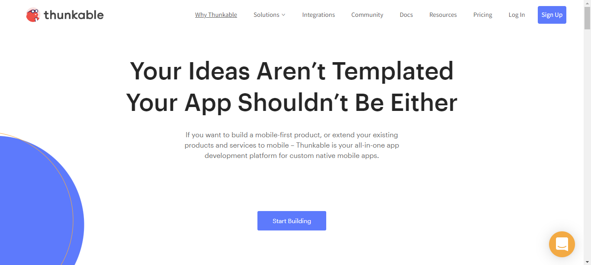
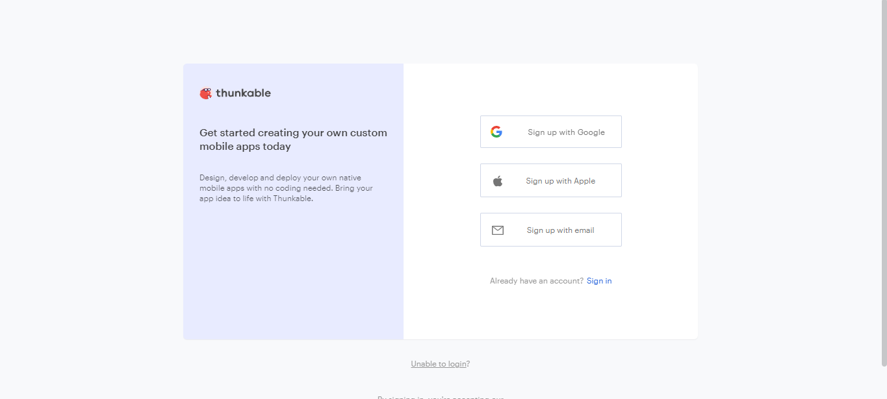
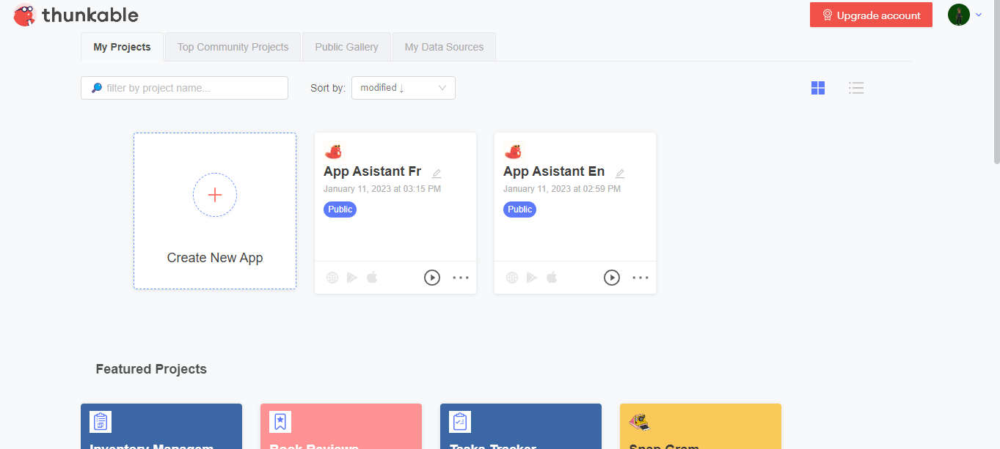

# How To Use Thunkable
To Use Thunkable You Will Need

* An Account
* An Active Internet
* (optional) An Apple Dev Account
* (optional) A Google Play Dev Account
That's it Now I Will Show You How To Make A Account

* 1 Go https://thunkable.com/#/why-thunkable
* 
* 2 Click Sign Up
* You Will See This Page
* 
* Click Sign Up With Google Or Apple Or Email
* Your Page Will Look Like This
* 

Now Go To Thunkable.md