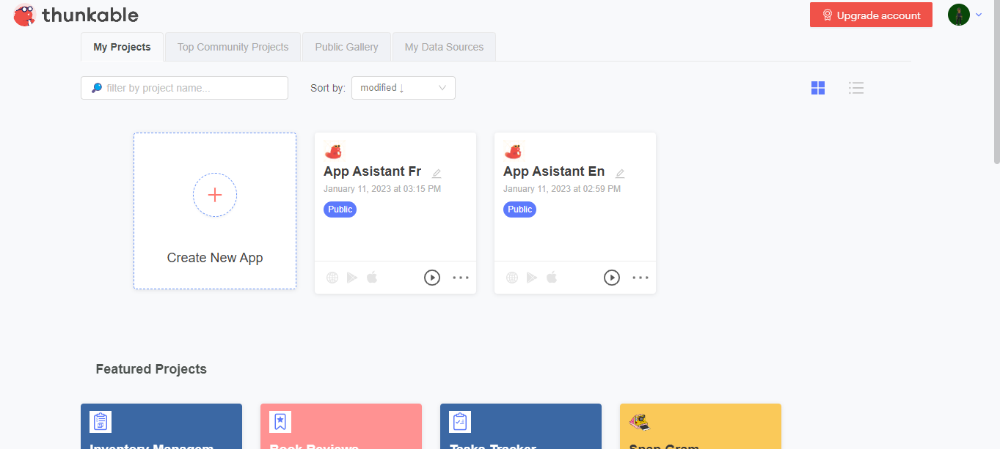

# Start Using Thunkable
Now We Are Gonna Make A Basic App
Open Thunkable

Click Create New App
Now That We Have Our App It Is Time To Start desining 
 
 To Start Go Click On Button
 
 Now You Have A Button
 
 Now Go To The Blocks Tab
 
 It Will Look Like This
 
 Now Click On button1
 You Will See This
 
 Now Add Some Code Blocks To Use The Button It Should Look Like This
 
 Now When You Click On The Button It Will Open New screen
  
  
  Thats How You Create A Basic App With Thunkable
 